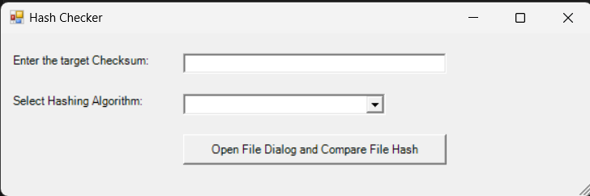

# CertUtil Windows Form

This Windows Form application allows users to check the SHA256 hash of a file. The application has room for improvement which will be done in the subsequent updates to the application.

# Update 20240731

The graphical user interface was updated, along with the algorithms that can be selected.

# Update 20240802

Added EXE for downloading. With Hashes for Downloading.

| Hash                              | Hash Algorithm |
|-----------------------------------|----------------|
| BA28E90FCFE07A65AC8102FDFCC33DAB  | MD5            |
| E5D2A851C0A2FD46A293045872A759539FB09D3D | SHA-1          |
| 0B66BCDDA33DC84884734CEB5D9EE78F9C3EFB0C7552F9ECE97177AA46C1A619   | SHA-256        |
| e3b0c44298fc1c149afbf4c8996fb92427ae41e4649b934ca495991b7852b85534A27D1175EA7659433BAF9138C74599205106F1C214650A262566EFC5405679AF4A5DA49567C7DB50719F834067AA85920B0A142881937F26AEAA7AD3C21C46 | SHA-512        |

Added ZIP for downloading. With hashes for downloading.

| Hash                              | Hash Algorithm |
|-----------------------------------|----------------|
| A1AE11F4E3A22A8A6F1B2250F0D09752  | MD5            |
| 91761AE25BBF6416F3B8C6A0FAC8523DDDB65AD3 | SHA-1          |
| 9F07ADA18719F1EA926F879B85AF1D5DB0E49B553CC064F1D2BA0B2A867D1ADC   | SHA-256        |
| 6AE284B8EEEC659EE9F4FC57BFB8840C7ED8E9FBEC392D3587D0108B71B737ECDFC01B6E9DEEE9B57BA744070BD4070A2316271A1F80E8D08D57B92976094DD0 | SHA-512        |

Added 7z for downloading. With hashes for downloading.

| Hash                              | Hash Algorithm |
|-----------------------------------|----------------|
| 63E4DBBD0E7FBA18E20DD9B56D2E9899  | MD5            |
| C1A97F063468C76B823AFA9A3521A2E8C4C482B8 | SHA-1          |
| 12F1E649C4276528BA9819606701A88C1891E39D0791CB1FF361DEF7590DDCE3   | SHA-256        |
| 22658FFC79D60E61DA7BEE0BA2E16292EFD97D4231F81C25BC0CF1EBA78BE2A77C7235F8F183B33C8246CE39D52BAE6E6C1C5BB58B7C396951E357B51ACFE7E8 | SHA-512        |

Added tar for downloading. With hashes for downloading.

| Hash                              | Hash Algorithm |
|-----------------------------------|----------------|
| CB0B30DD7640FDA4CA9941C74BD62A62  | MD5            |
| E7CC2B948765F6781BD96B5AAE8476B669F06CD5 | SHA-1          |
| 038B57C59FB73143F344252866D22042F617513F79AB333AC3483778EDC27BAC   | SHA-256        |
| ABEF7C0FA4562A24851EC0F1F6ACA0343820EAC191034FF1ECFA816658C24F10E0B215CA1B3193B80377C7E439AF58F41B092CEC55F24BEE928C593ACB334E3E | SHA-512        |

## Acknowledgements

 - Professors at Kean University
 - Professors at NJIT
 - Research Mentors at Kean University
 - StackOverflow Q&A Discussion
 - ChatGPT
 - ClaudeAI

## Authors

- [@FPyC639](https://github.com/FPyC639)

## Appendix

